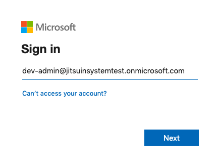
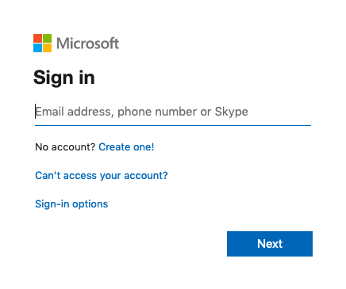
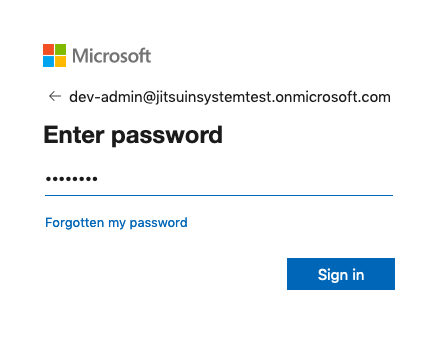
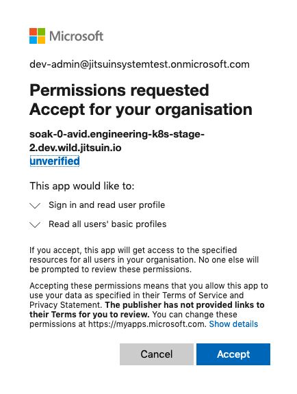
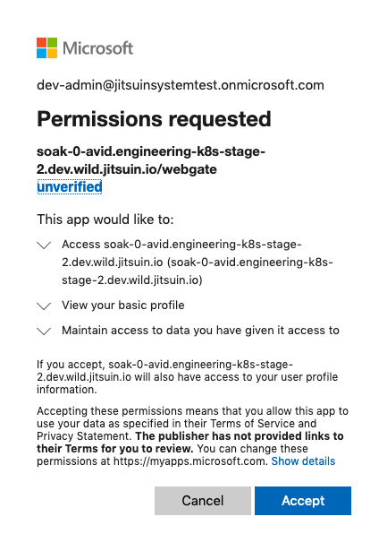

.. _azure-admin-consent:

Azure Active Directory Admin Consent
------------------------------------

To enable user management for the Jitsuin Archivist:

#. Login to the Jitsuin Archivist at the supplied link to complete the admin
   consent process.
#. Ensure **User assignment required** is set on the properties of the
   Enterprise Application principal for your Jitsuin Archivist.

Upon receiving your Jitsuin Archivist link login with an administrative
account. This triggers the 'admin consent' flow authorizing the Jitsuin
Archivist. Granting consent does the following:

* It enables access to the basic profile information of assigned users.
* It creates the service principals for managing user access.

.. note::
   Until this process is completed no users will have access. The administrative
   account used must have at least the **Application Administrator** role.

.. note::
   Access to the basic profile information is necessary for recording who
   performed specific actions.

.. note::
   A prompt for users to grant individual consent may appear on their first
   login. This is dependent on directory configuration.

The Microsoft article `configuring consent`_ describes the options for your
administrator.  This link describes the general `consent experience`_

.. _`consent experience`: https://docs.microsoft.com/en-us/azure/active-directory/develop/application-consent-experience
.. _`configuring consent`: https://docs.microsoft.com/bs-latn-ba/azure/active-directory/manage-apps/configure-user-consent

Attempt to login at the provided link
`````````````````````````````````````

You will first be directed to the common endpoint of the Microsoft Identity
Platform.
|admin-consent-any-user-email|



Regardless of the account used you will then be redirected to the adminconsent
endpoint.
|admin-consent-redirect|




Login with an administrator account
```````````````````````````````````

The email and password for an account with at least the **Application
Administrator** role is required.
|admin-consent-redirect-email-pass|



Grant consent on behalf of your organisation
````````````````````````````````````````````

|admin-consent-accept-for-org|




Grant personal consent
``````````````````````
Having consented for your organisation, the login flow attempts to log you in
to your account. Depending on directory configuration, This may need your
personal consent.

|admin-consent-accept-for-you|



.. note::
   The login flow will now redirect you back to your Jitsuin Archivist. You
   will not be able to login until you complete the user assignment process.
