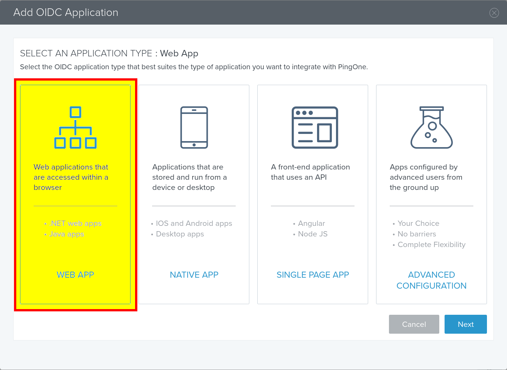
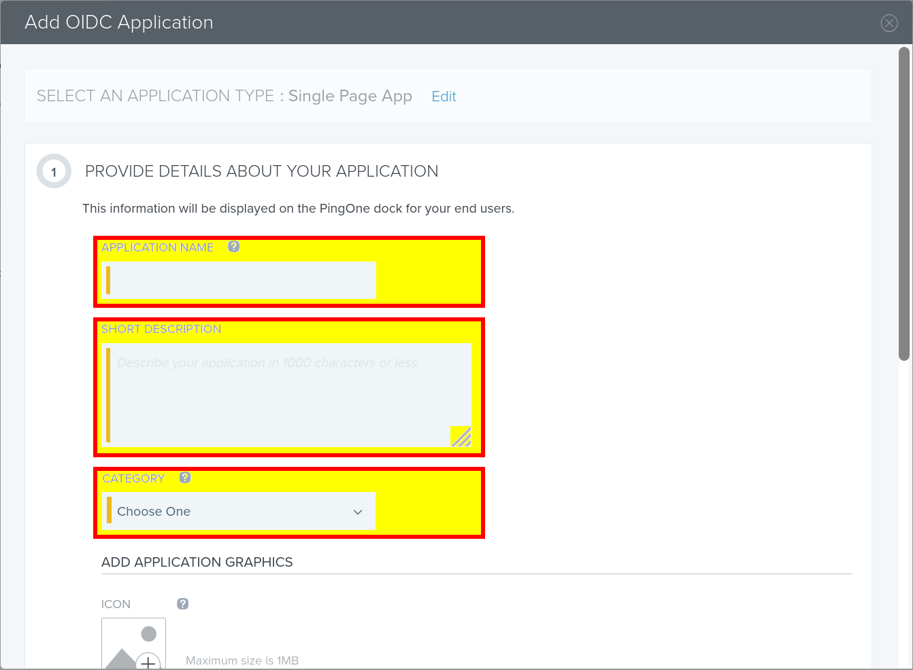
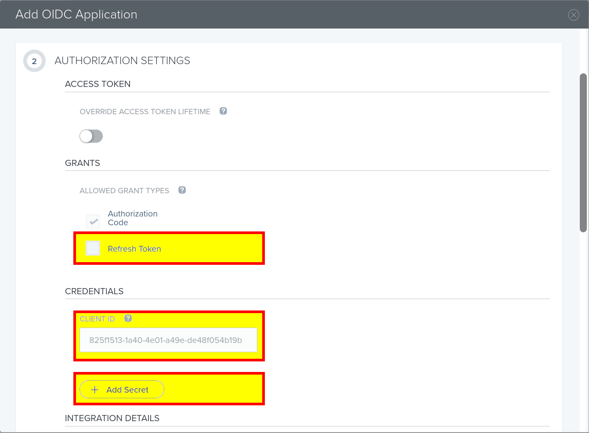
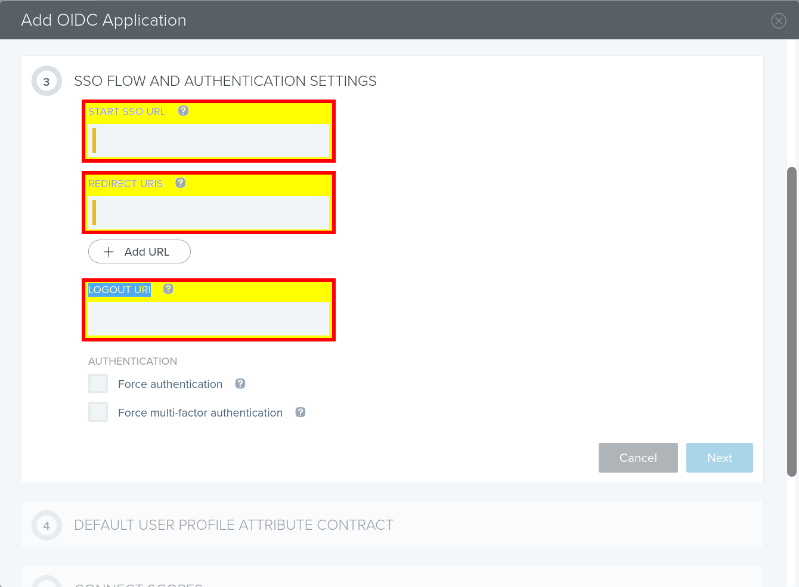
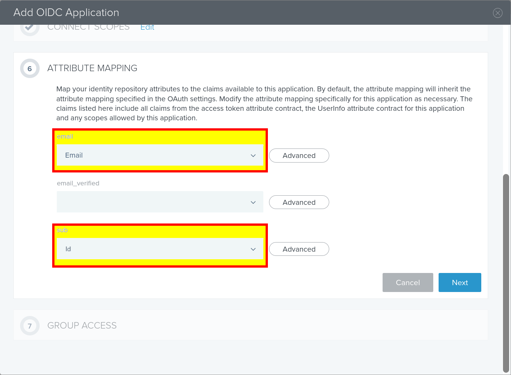
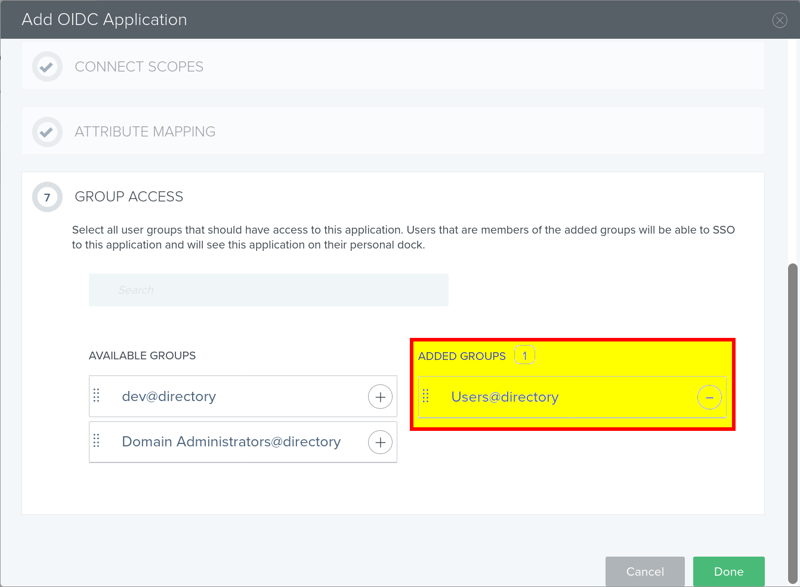

.. _azure-admin-consent:

Using PingOne for Enterprise as IDP
-----------------------------------

This guide provides intructions on how to integrate PingOne for Enterprise IDP
with Jitsuin Archivist.

Before starting:

* Jitsuin will provide a unique URL that will be used when creating the application in PingOne for Enterprise

* Note that some values from step 6 below will be needed by Jitsuin to complete the integration.

* Ping Identity also provide instructions for adding application in the following link: https://docs.pingidentity.com/bundle/pingone/page/rkz1564020496702-1.html

Steps:

1. Log into PingOne for Enterprise and navigate to "My Applications"

2. Add a new OIDC application and follow the steps below

3. Select application type "Web App" and click Next

|pingone_wizard_step_oidc|

4. (Wizard Step 1) Provide application details as desired (i.e. Application name: Archivist)

|pingone_wizard_step_1|

5. (Wizard Step 2) Configure authorization settings

  1. Enable "Refresh Token"

  2. Click the "Add Secret" button

  3. Send the client ID and client secret to Jitsuin. These are needed to complete the integration in the hosted Archivist application

  4. Leave other values default or set as desired

|pingone_wizard_step_2|

6. (Wizard Step 3) Enter the unique URLs as provided by Jitsuin

|pingone_wizard_step_3|

7. (Wizard Step 4) Click Next

|pingone_wizard_step_4|

.. |pingone_wizard_step_4| image:: pingone-wizard-step-4.png

8. (Wizard Step 5) Add Email scope to Connected scopes

|pingone_wizard_step_5|

.. |pingone_wizard_step_5| image:: pingone-wizard-step-5.png

9. (Wizard Step 6) Select "Email" for email attribute mapping and "member of" for sub attribute mapping

|pingone_wizard_step_6|
   pingone

10. (Wizard Step 7) Add appropriate groups to allow desired access for users

|pingone_wizard_step_7|

.. note::
Once Jitsuin has received the client ID and secret the connection will be completed and the Archivist app will be available on the URL provided using SSO login credentials.
