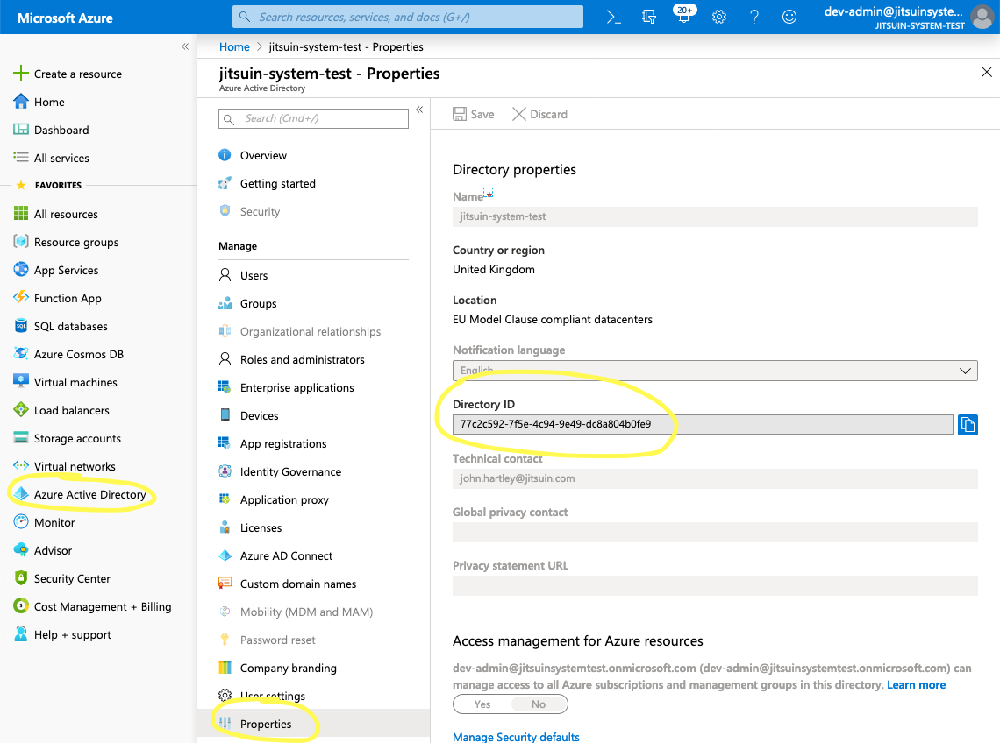

.. _register-with-jitsuin:

Register your Azure Active Directory with Jitsuin
-------------------------------------------------

To obtain access to your Jitsuin Archivist:

#. Communicate your azure directory id to Jitsuin.
#. Receive a link to your Jitsuin Archivist.

.. _locate-directory-id:

Locating your directory id
``````````````````````````

Go to the home tab for your directory on portal.azure.com and select the
properties blade. Send the directory id to jitsuin.
|azure-directory-id|

.. note::
   This identifier is not sensitive information.



