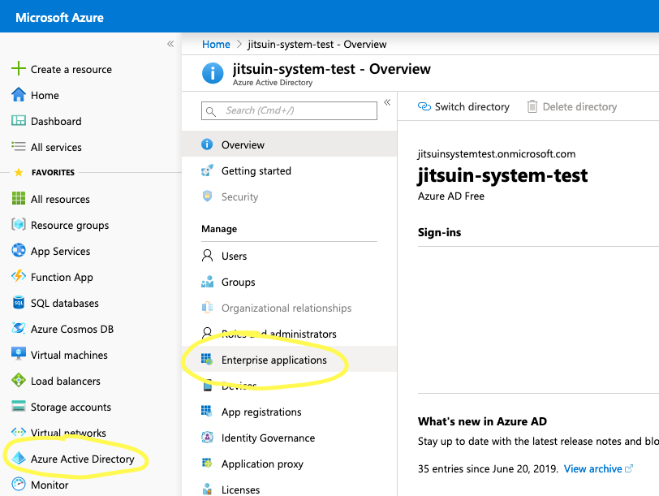
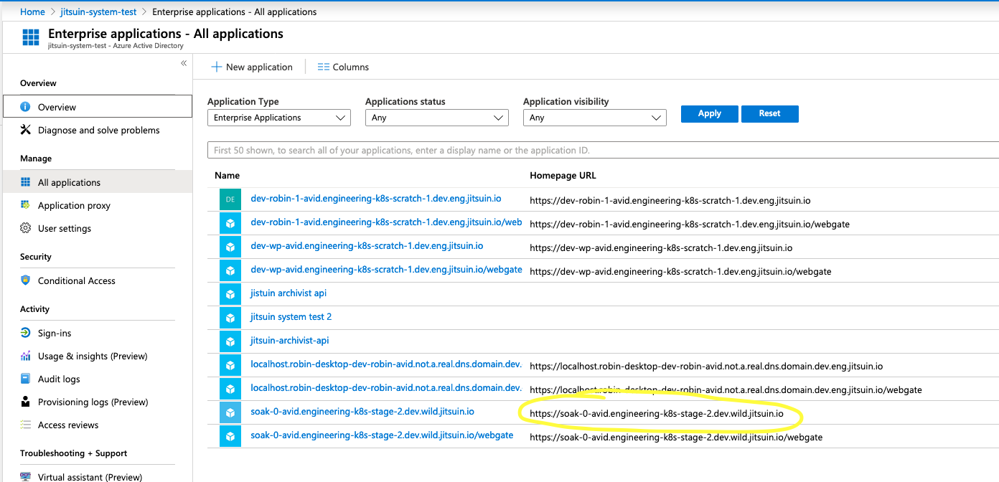
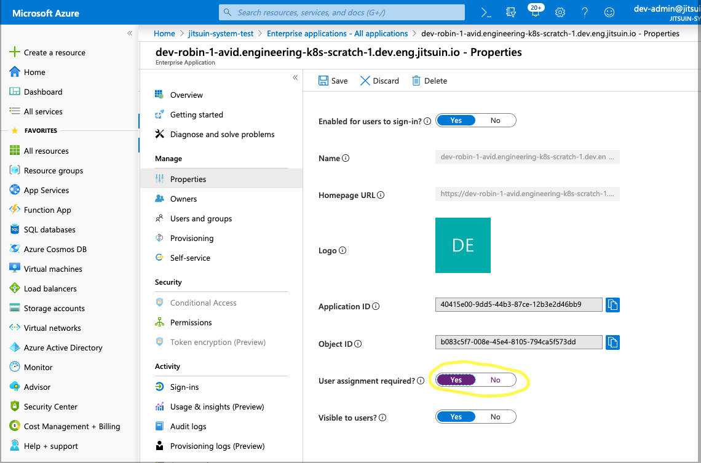
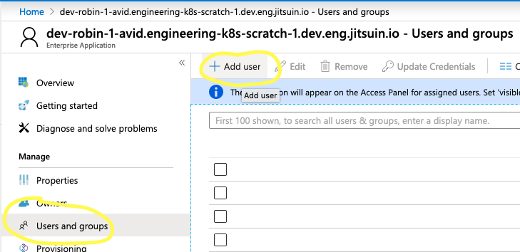
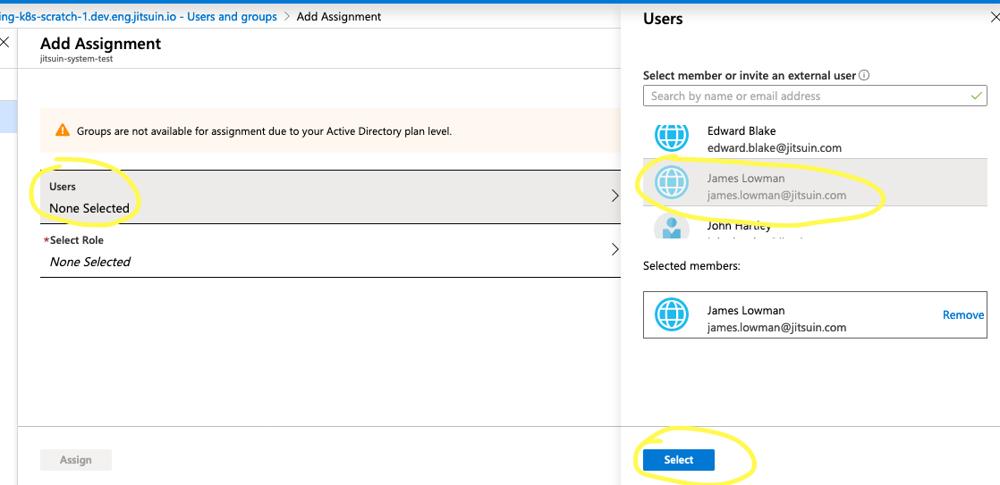
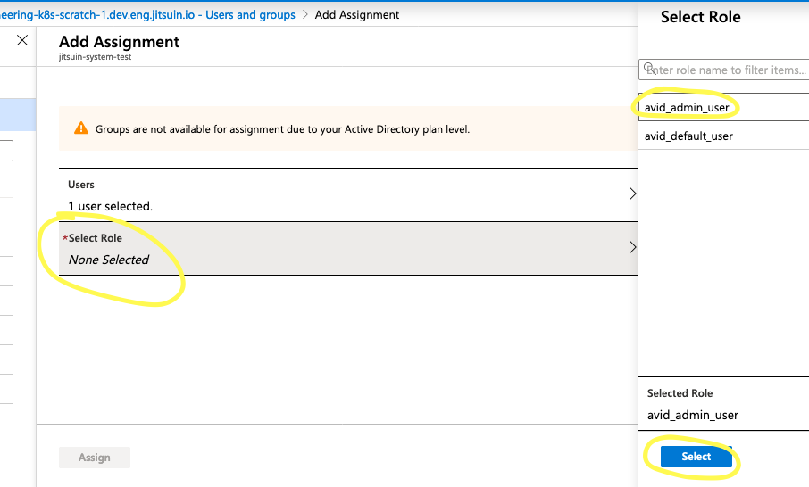

.. _azure-aad-assign-users:

Assign Users for Interactive use
--------------------------------

To enable access for individual users to your Jitsuin Archivist:

#. Assign Users to the Jitsuin Archivist Enterprise application.
#. Grant assigned users the appropriate Jitsuin Archivist roles.

This Microsoft guide provides the general details for `assigning users`_ and
their roles.

.. _`assigning users`: https://docs.microsoft.com/bs-latn-ba/azure/active-directory/manage-apps/assign-user-or-group-access-portal

The key steps are as follows:

Locate your Jitsuin Archivist Enterprise Application
````````````````````````````````````````````````````

Having completed admin consent, locate the enterprise application principals
for your Jitsuin Archivist. There will be two **Homepage URLs** which match the
FQDN for the link you received. The URL for the root resource is your API
principal. This is where assign users their roles. It is also where you asign
roles for non interactive clients.
|enterprise-app-locate|



.. note::
   The /webgate principal authorises your Jitsuin Archivist deployment to act
   on your users behalf. It needs no further configuration.

Select the principal with the Homepage URL matching your link.
|enterprise-app-locate-by-link|




Check that User assignment is required for your Jitsuin Archivist
`````````````````````````````````````````````````````````````````

The **User assignment required** setting must be **yes** in order to restrict
access to particular users in your directory. If it is set to **no** *any* user
at your organisation will be able to login.

|enterprise-app-user-assignment-required|



Add user to the enterprise application
``````````````````````````````````````
|enterprise-app-add-user|



Select the user for role assignment
```````````````````````````````````
|enterprise-app-add-user-select|



See :ref:`jitsuin-roles` for description of the various roles available.

Assign the user a Jitsuin Archivist role
````````````````````````````````````````
|enterprise-app-user-role-asign|


