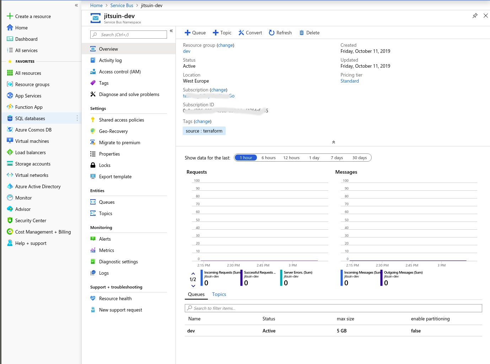
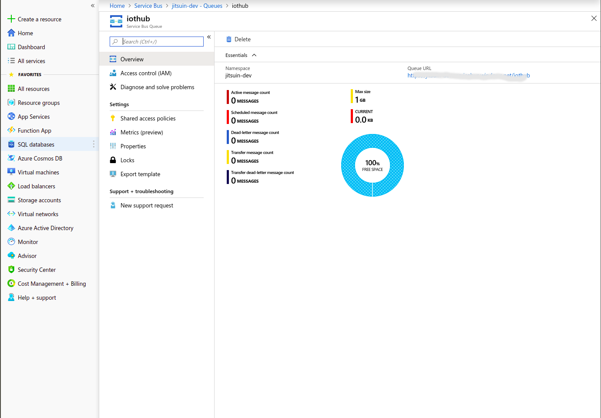
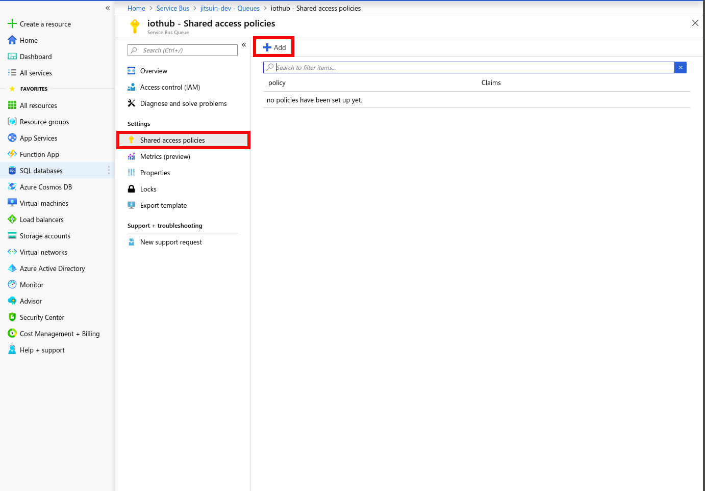
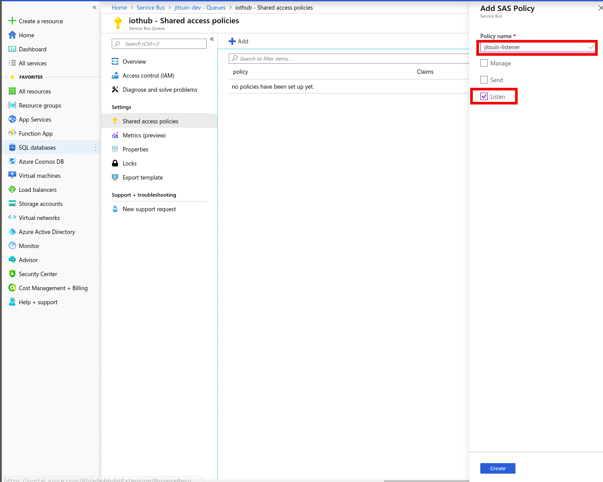
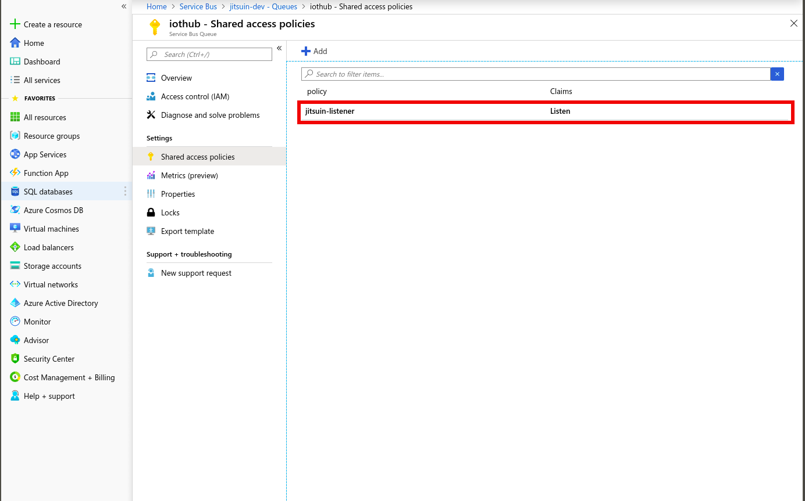
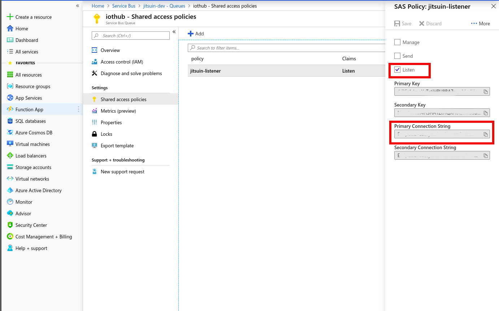
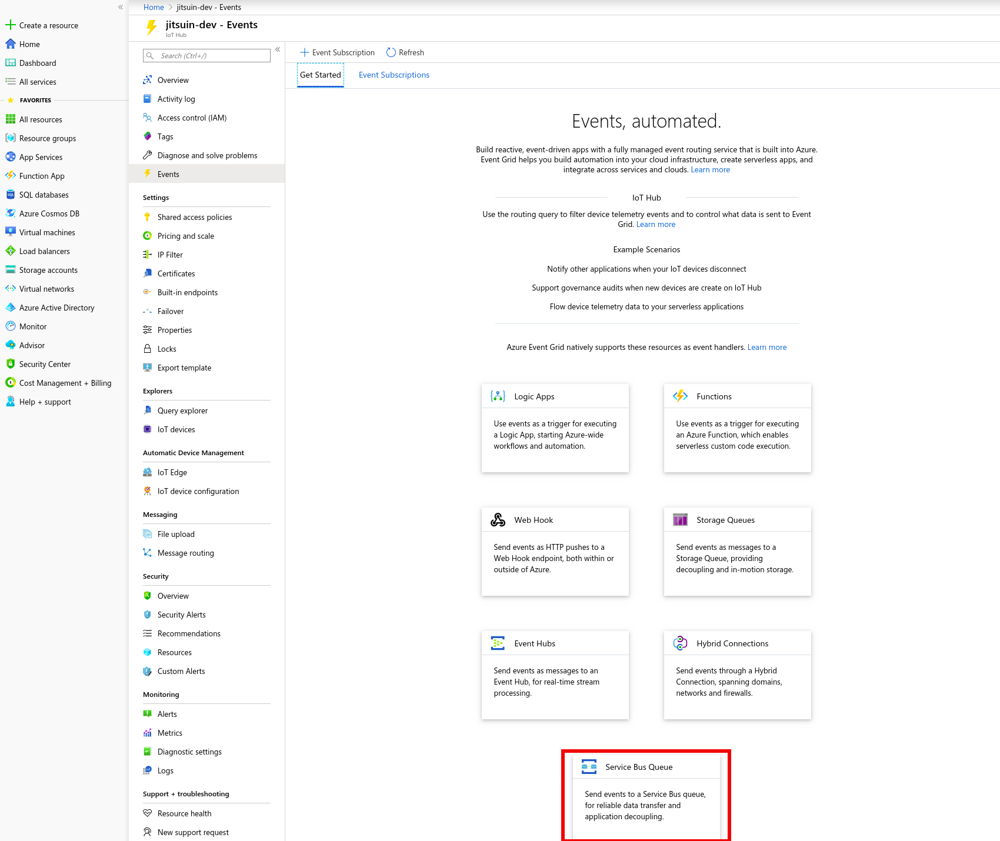
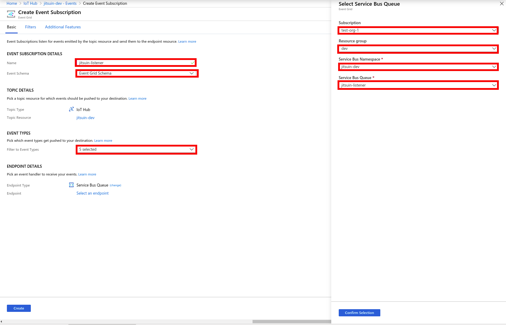
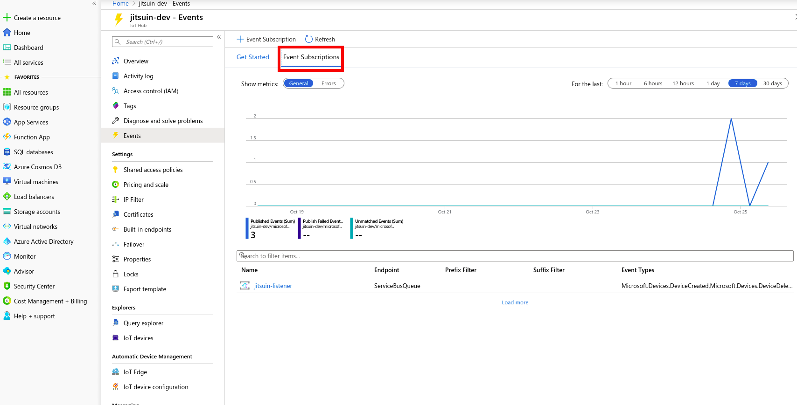
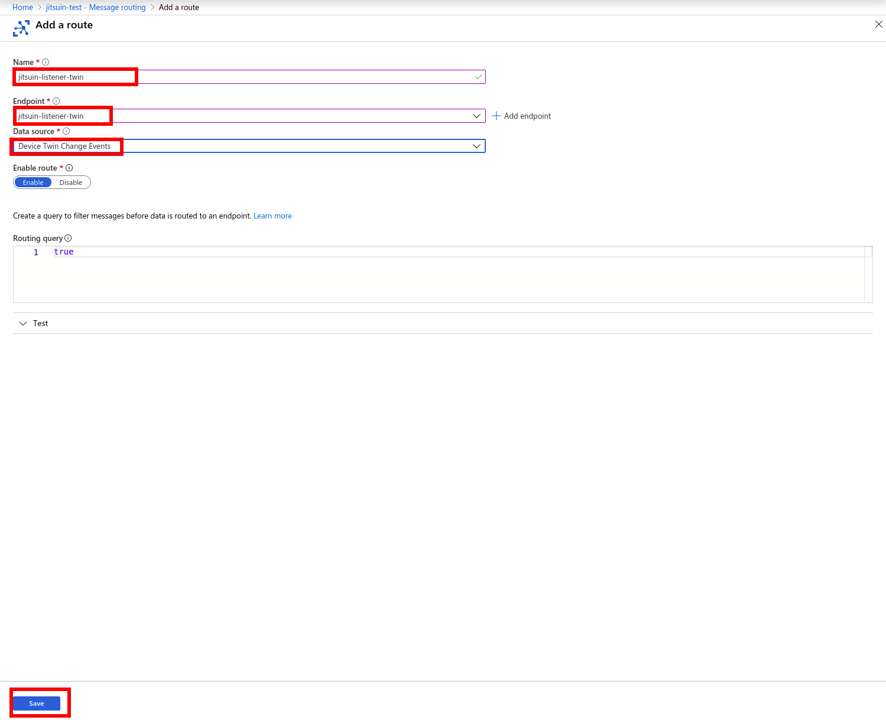

.. _iothub_subscription:

Subscribing To IoTHub events
-----------------------------

References
``````````

`Create routing from commandline <https://docs.microsoft.com/bs-cyrl-ba/azure/iot-hub/tutorial-routing#use-the-azure-cli-to-create-the-base-resources>`_

Overview
````````

Currently the Jitsuin Service Bus Subscription service only supports subscribing to a Service Bus Queue endpoint.
An Azure Service Bus Queue must be created and connected to an Azure IotHub endpoint using either Azure CLI operations
as described in the references or by using portal.azure.com and creating the endpoint interactively.

This document only describes the portal.azure.com method.

Portal.azure.com
````````````````

To start Login to portal.azure.com

Servicebus
''''''''''

.. |portal-servicebus| image:: portal-servicebus.png

Search for **Servicebus**.
|portal-servicebus|
 
Namespace
'''''''''



Choose your namespace (in this case **jitsuin-dev**).
|portal-subscription|

Queues
''''''

.. |portal-queues| image:: portal-queues.png

Select **Queues** in the sidebar.
|portal-queues|

Add Queue
'''''''''

.. |portal-add-queue| image:: portal-add-queue.png

Select **+Queue**.
Ensure that the queue is named (in this document: **iothub**) and duplicate detection is enabled.
Sessions is **not** enabled.
Select **Create** and Wait.
|portal-add-queue|

Show Queues
'''''''''''

.. |portal-show-queues| image:: portal-show-queues.png

Created queues are shown.
|portal-show-queues|

New Queue
'''''''''



Select the new queue.
|portal-show-queue|

Shared Access Policies
''''''''''''''''''''''



Select **Shared Access Policies**.
|portal-shared-access-policy|

Set Policy
''''''''''




Select **+Add**, set name to something suitable and select **Listen**. Wait.
|portal-policy-listener|

List Policies
'''''''''''''



The policy is now listed.
|portal-policy-list|

.. _subscription_connection_string:

Get Connection String
'''''''''''''''''''''



Select the policy (in this case **jitsuin-listener**) and copy the connection string into the clipboard.
Save the connection string somewhere safe.
To setup the subscription service in Archivist both the connection string and the queue name are required.
|portal-connection-string|

Iothub
''''''

.. |portal-iothub| image:: portal-iothub.png

Search for **iothub**.
Select the correct iothub (in this case **jitsuin-dev**).
|portal-iothub|

Select Iothub
'''''''''''''

.. |portal-select-iothub| image:: portal-select-iothub.png

Select **Events** from the sidebar.
|portal-select-iothub|

Service Bus Queue
'''''''''''''''''



Select **Service Bus Queue** at the bottom of the page.
|portal-events-get-started|

Specify Service Bus Queue
'''''''''''''''''''''''''



Specify a suitable name (in this case **jitsuin-listener**),
**Event Schema** is set to **Event Grid Schema**,
**Filter to Event Types** is set to select all options - 5 selections in total (see dropdown menu),
**Endpoint Type** is set to **Service Bus Queue**.
**Select endpoint** pops up a sidebar as shown - fill in details as shown (in this case the Service Bus Queue name is set
to **jitsuin-listener**.
When correct select **Confirm Selection** for the service bus queue details and **Create** to save the Event subscription.
|portal-set-service-bus-queue|

Show Event Subscriptions
''''''''''''''''''''''''



Select **Event Subscription** tab to confirm that the subscription is created.
|portal-event-subscription|

Message Routing
'''''''''''''''

.. |portal-message-routing| image:: portal-message-routing.png

Select **Message Routing** tab to setup routing.
Select **Custom Endpoints** and **+Add** to add a route.
Select **Service Bus Queue**.
|portal-message-routing|

ServiceBus Endpoint
'''''''''''''''''''

.. |portal-add-servicebus-endpoint| image:: portal-add-servicebus-endpoint.png

Set **Endpoint Name** to a suitable name (in this case **jitsuin-listener-twin**).
Set **Service Bus Namespace** (in this case **jitsuin-dev**).
Set **Service Bus Queue** (in this case **jitsuin-listener**).
Select **Create** and wait.
The Custom Endpoint should now be displayed.
|portal-add-servicebus-endpoint|

Select Route
''''''''''''

.. |portal-add-route| image:: portal-add-route.png

Select **Routes* and **+Add** to add the route.
The Custom Endpoint should now be displayed.
|portal-add-route|



Set **Name** to a suitable value (in this case **jitsuin-listener-twin**).
Set **Endpoint** to the endpont name (in this case **jitsuin-listener-twin**).
Set **Data Source** to **Device TwinChange Events**.
Select **Save** and wait.
The Route will now be displayed.
|portal-add-a-route|

Enabling subscription in Archivist
''''''''''''''''''''''''''''''''''

Follow the instructions in the Application Link section of this document for
**Service Bus sources** :ref:`svcbussources_api` to start feeding Microsoft IoTHub events into the Jitsuin
Archivist system. The parameters required to start a subscription are the servicebus connection string and the queuename
saved from  :ref:`subscription_connection_string` above.


